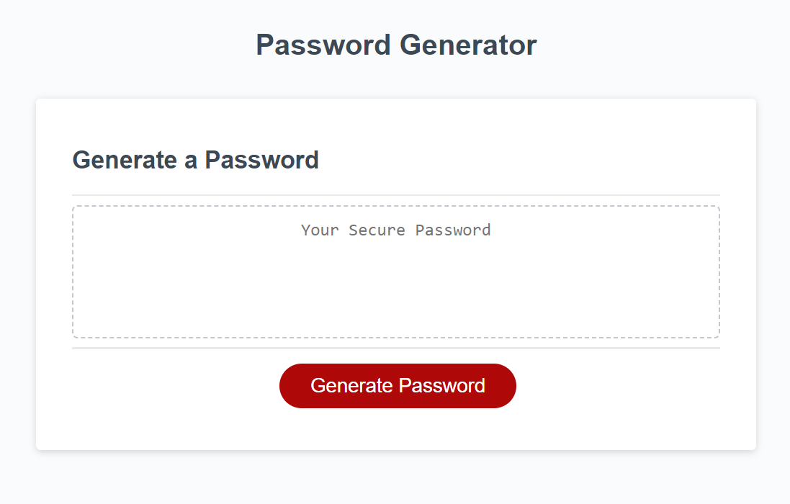

# Password generator
This is a simple JavaScript-based application that generates passwords based on user preferences for length and character types.

## Features
Password Length: Users can specify the length of the password (between 8 and 128 characters).
Character Types: Users can choose to include special characters, numeric characters, lowercase letters, and uppercase letters in the generated password.
Random Generation: The passwords are generated using randomly selected characters from the chosen character sets.

## Link: https://natalie-0073.github.io/password-generator/

### Picture:
